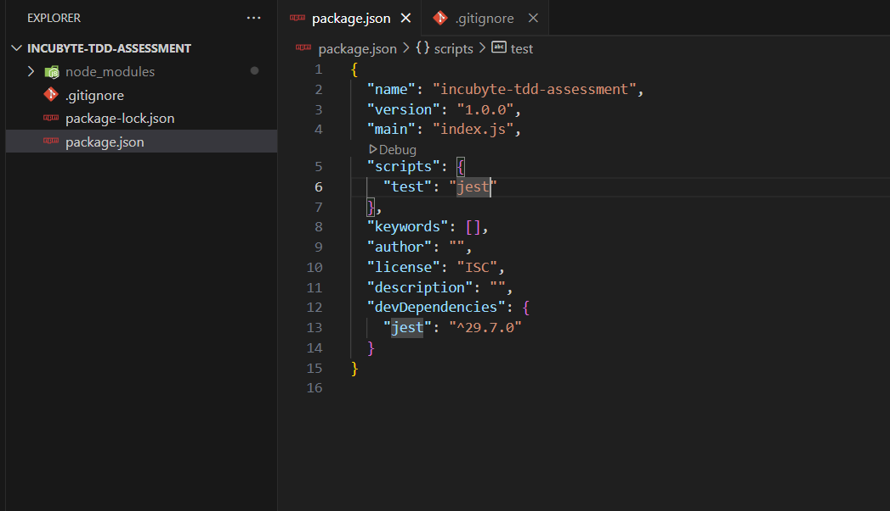
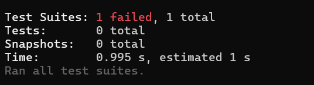
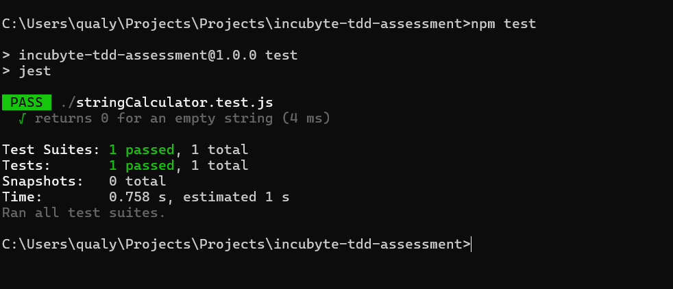
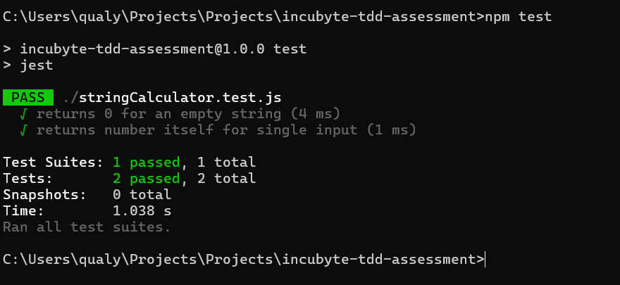
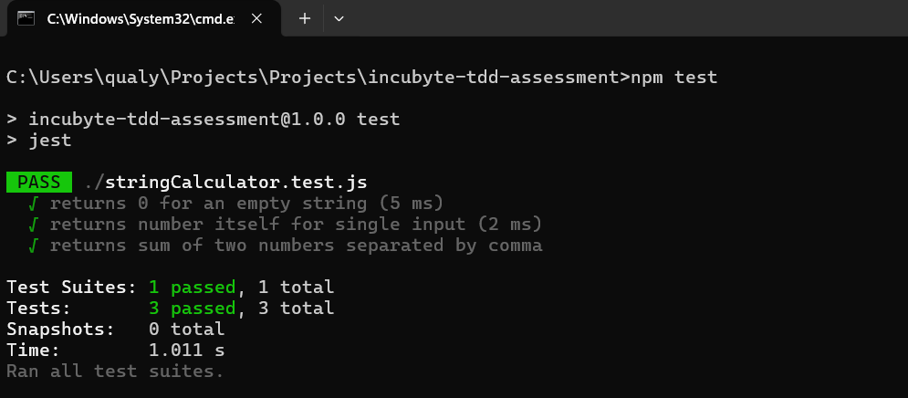
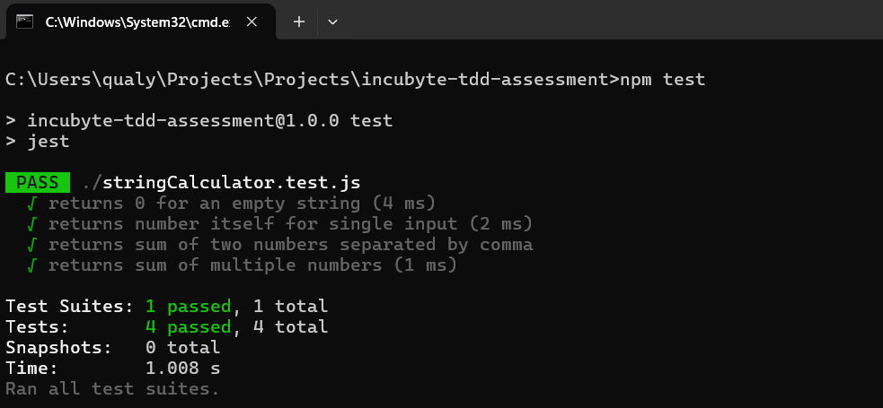
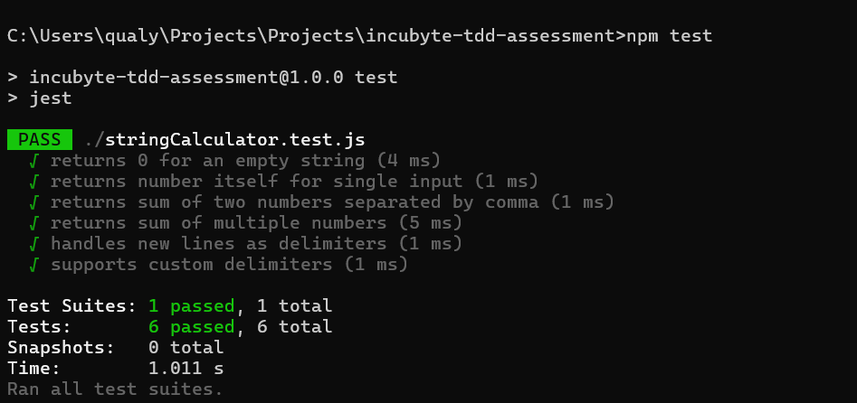
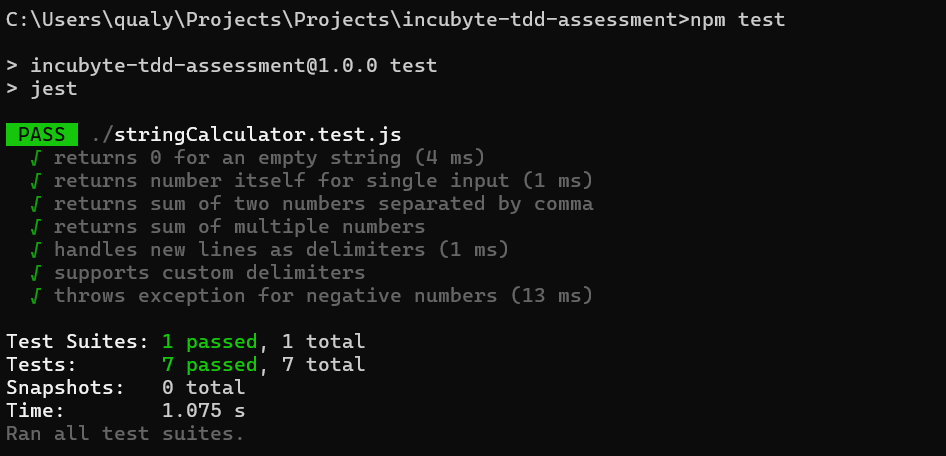

# Incubyte TDD Assessment - String Calculator

This project implements a String Calculator using Test-Driven Development (TDD) with Node.js and Jest.

## Installation

1. Clone the repository:
    ```bash
    git clone https://github.com/PraveenDung/incubyte-tdd-assessment.git
    cd incubyte-tdd-assessment
    npm install
    ```

2. Run tests:
    ```bash
    npm test
    ```

## Features Implemented
- Empty string returns `0`
- Single number returns itself
- Sum of two or more comma-separated numbers
- Support for newline (`\n`) as a delimiter
- Custom delimiters using `//[delimiter]\n`
- Negative number validation with an exception

##  Examples
| Input                     | Output                   |
|---------------------------|--------------------------|
| `""`                      | `0`                      |
| `"5"`                     | `5`                      |
| `"1,2,3"`                 | `6`                      |
| `"1\n2,3"`                | `6`                      |
| `"//;\n1;2"`              | `3`                      |
| `"1,-2,3,-4"`             | Exception: `negative numbers not allowed: -2,-4` |

## 📸 Screenshots
1. **Project Setup**  
   

2. **First Failing Test (Red Phase)**  
   

3. **First Passing Test (Green Phase)**  
   
   

4. **Sum of Two Numbers**  
   
   

5. **Custom Delimiter Support**  
   

6. **Negative Numbers Exception**  
   


## 🏁 Conclusion
This project demonstrates the TDD approach in software development. All code is well-tested and follows clean coding practices.
